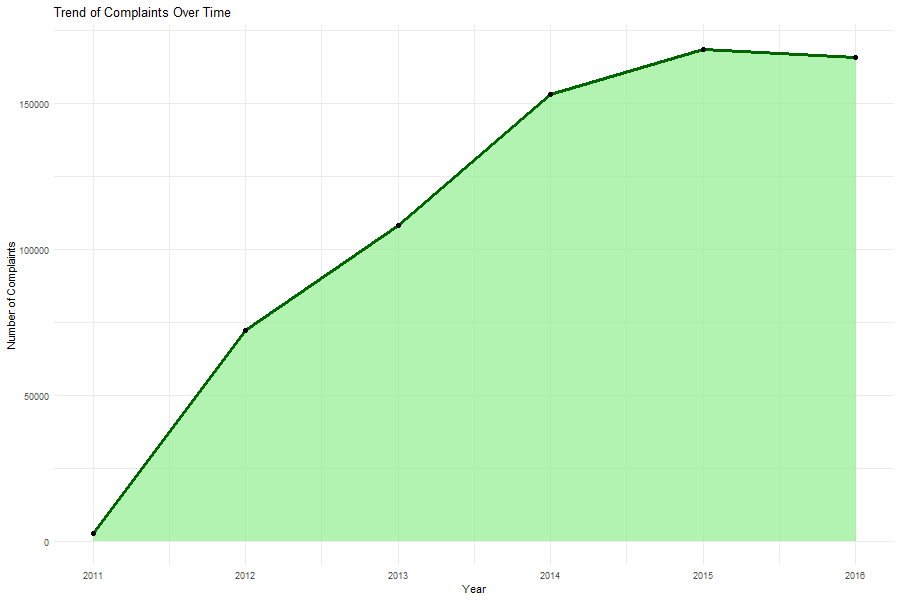
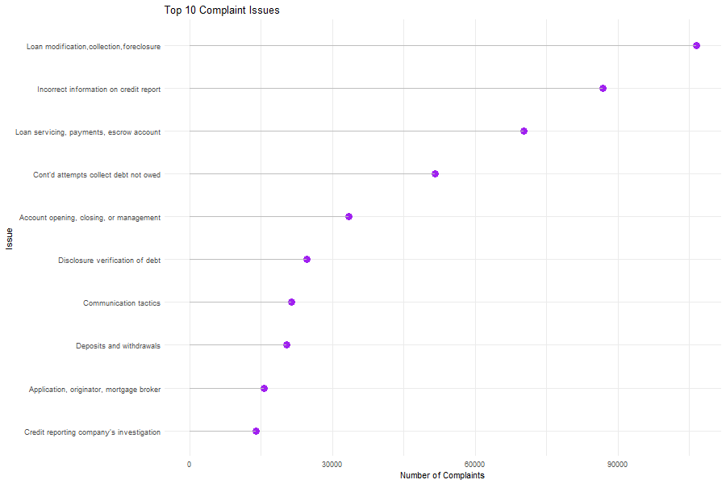
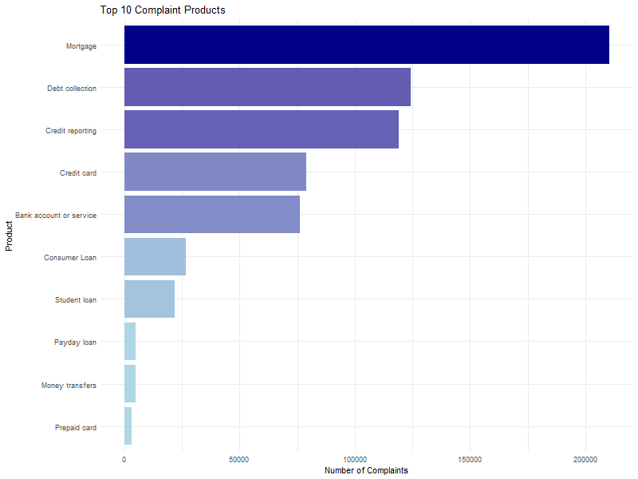
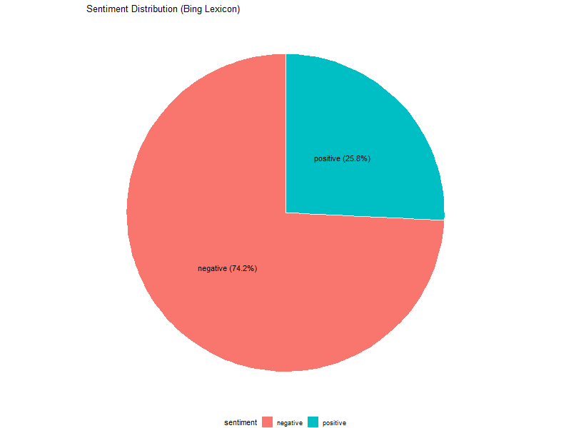
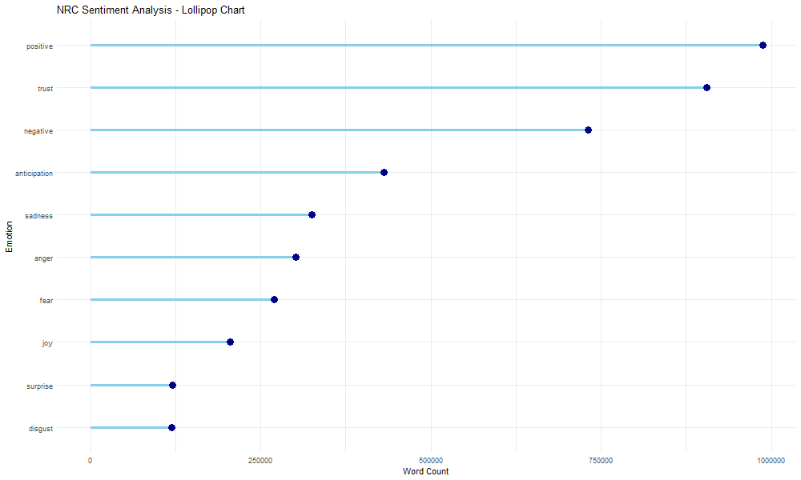

## Introduction
This report presents a text analysis of consumer complaints data. The goal is to explore common issues, sentiment trends, and overall patterns in complaints.

## Word Cloud


**Observation:** The most frequent words in complaints are prominently displayed. This helps identify key concerns consumers have. 

**Why this was done:** A word cloud is an effective way to visualize the most common words in textual data, highlighting recurring themes in complaints.

## Complaints Over Time


ts_over_time.png…]()
ALSE}

```
**Observation:** Complaint trends fluctuate over time, indicating possible seasonal variations or external events affecting complaint volume.

**Why this was done:** Understanding trends over time helps identify peak complaint periods and potential causes.

## Top Issues Reported
```{r, echo=FALSE}

```
**Observation:** The most commonly reported issues suggest recurring problems within certain products or services.

**Why this was done:** This helps prioritize areas for improvement and gauge customer pain points.

## Top Products in Complaints
```{r, echo=FALSE}

```
**Observation:** Certain products receive more complaints than others, indicating potential quality or service concerns.

**Why this was done:** Identifying problematic products enables companies to focus on improving those areas.

## Sentiment Analysis (Bing Method)
```{r, echo=FALSE}

```
**Observation:** The distribution of sentiment scores reveals how customers generally feel about their complaints.

**Why this was done:** Sentiment analysis helps understand the emotional tone behind complaints, providing insights into customer dissatisfaction.

## Sentiment Analysis (NRC Method)
```{r, echo=FALSE}

```
**Observation:** The NRC method categorizes emotions, highlighting the most common emotional responses in complaints.

**Why this was done:** This allows for a deeper understanding of customer emotions beyond positive or negative sentiment.

## Conclusion
The analysis provides insights into customer complaints, common issues, and sentiment trends. This information can be used to improve products, address customer concerns, and enhance overall satisfaction.
